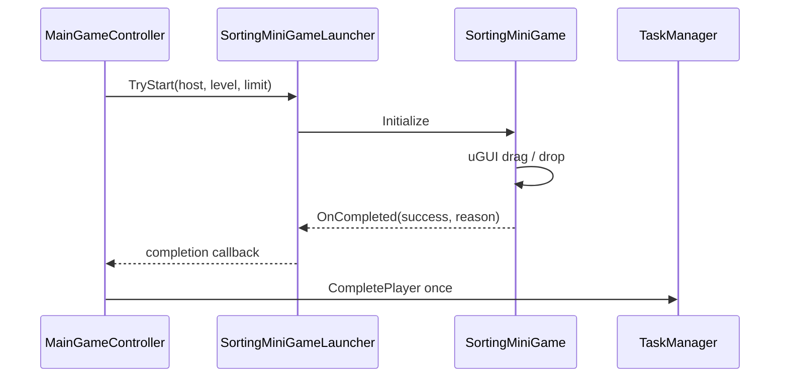

# Class detail: shared drag-and-drop mini-game

Last updated: 2026-08-04  
Files: `Assets/Scripts/MiniGameS/DragDrop/SortingMiniGame.cs`, `SortingMiniGameLauncher.cs`

## Responsibility

This feature adapts the Motonaga sorting prototype into the shared `TaskKind.DragDrop` player-mini-game contract. It uses uGUI drag events only; no 2D or 3D physics is involved. The Personal prototype remains unmodified.

## Public contract

| API / event | Meaning |
| --- | --- |
| `SortingMiniGameLauncher.TryStart` | Creates one temporary sorting game below `MiniGameHost` and reports its single completion callback to Core. |
| `SortingDraggable` | Tracks the pointer while dragging one card and restores it when no valid box receives it. |
| `SortingDropBox.OnDrop` | Accepts a card, then delegates correct/incorrect handling to `SortingMiniGame`. |
| `SortingMiniGame.Drop` | Removes correct cards; two incorrect drops finish with `MISSED`. |

## Lifecycle

## Current rules and TODO

- Three cards must be sorted into two boxes (`INBOX` and `ARCHIVE`). This is a small shared vertical slice derived from the prototype.
- Two incorrect drops end the mini-game with failure, matching the prototype's miss cap.
- The supplied task level and time limit are accepted by the launcher. The current card composition is intentionally fixed; per-level card count, labels, and timing are M6 tuning TODOs rather than settled specifications.
- `Assets/Prefabs/MiniGames/SortingMiniGame.prefab` is the approved shared root and is instantiated/destroyed by the launcher. The current inner controls are still code-generated; author the final child view in that shared Prefab without changing the launcher contract.

## Verification

- Unity compiled with no Console errors.
- In the Game scene, a `DragDrop` task was created and assigned through `MainGameController`; the launcher started successfully.
- TODO: visually tune the card and box layout, then manually play-test pointer drag/drop using the final shared Prefab view.
