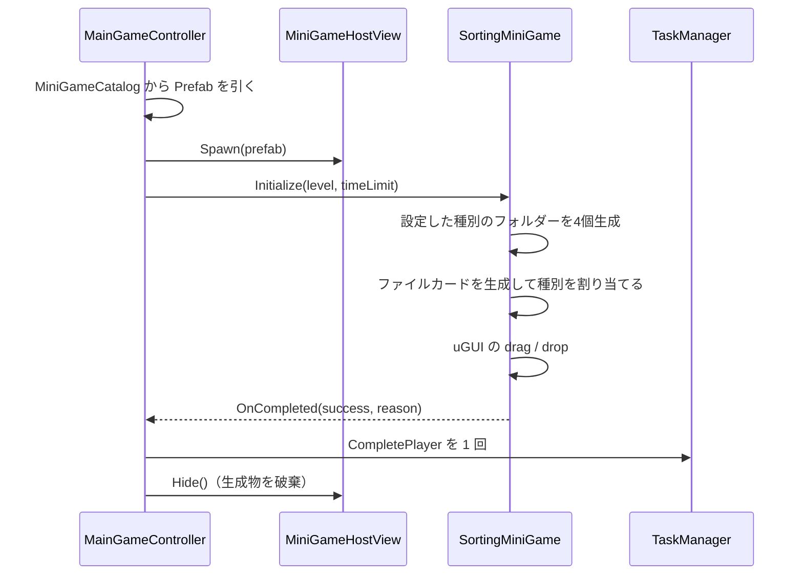

# クラス詳細: 仕分けミニゲーム

最終更新: 2026-08-06  
実装: `Assets/Scripts/MiniGameS/DragDrop/SortingMiniGame.cs`, `SortingDraggable.cs`, `SortingDropBox.cs`, `SortingTypes.cs`  
Prefab: `Assets/Prefabs/MiniGames/SortingMiniGame.prefab`、`Assets/Prefabs/MiniGames/Parts/SortingFileCard.prefab`、`SortingFolder.prefab`

## 責務

uGUI のドラッグイベントだけでファイルカードをフォルダーへ仕分ける。本編の `TaskKind.DragDrop` から起動し、2D / 3D の物理演算や LayoutGroup は使わない。レベル開始時にカードとフォルダーをテンプレートから生成し、配置・進行・正誤判定は `SortingMiniGame` が管理する。

## 公開契約

| API / 型 | 意味 |
| --- | --- |
| `SortingFileKind` | Document / Image / Audio / Script の仕分け種別。文字列ではなく enum で対応を固定する。 |
| `SortingKindStyle` | 種別ごとのファイルアイコン、フォルダー色、表示ラベル。ファイルアイコンには色を乗せない。 |
| `SortingLevelSetting` | レベルごとのファイル枚数、使用する最大種別数、許容ミス数。 |
| `SortingDraggable.Setup` | 種別とファイルアイコンを設定してカードを初期化する。 |
| `SortingDropBox.Setup` / `OnDrop` | フォルダーの種別・色・ラベルを設定し、カードを受けて判定を `SortingMiniGame` へ渡す。 |
| `SortingMiniGame.Drop` | 正解カードを取り除き、許容ミス数または全カード消化で終了する。 |

## ライフサイクル

## 設定

| 項目 | 場所 |
| --- | --- |
| 制限時間 | `Assets/Data/MiniGameCatalog.asset` の `DragDrop` 行 |
| カード・フォルダーの見た目とサイズ | `Assets/Prefabs/MiniGames/Parts/SortingFileCard.prefab` / `SortingFolder.prefab` |
| 作業領域とテンプレートの位置 | `Assets/Prefabs/MiniGames/SortingMiniGame.prefab` |
| 種別ごとのアイコン・色・ラベル | `SortingMiniGame.kindStyles` |
| レベルごとの枚数・種別数・許容ミス | `SortingMiniGame.levelSettings` |

フォルダーは常に4個を表示する。選択した種別はカード枚数が許す限り各1枚以上含め、残りをランダムに割り当てて並べ替える。現在の既定値は Lv.1〜4 がそれぞれ 3 / 4 / 5 / 6 枚、最大種別数が 1 / 2 / 3 / 4、許容ミス数が 2 である。

## 検証と TODO

- EditMode でコードのコンパイルと既存のミニゲームテストを確認する。
- Play モードで Game シーンの `DragDrop` タスクから起動し、全4種別の表示、誤ドロップ、成功終了を確認する。
- TODO: 実機のポインター操作と各レベルのプレイ感を確認する。
