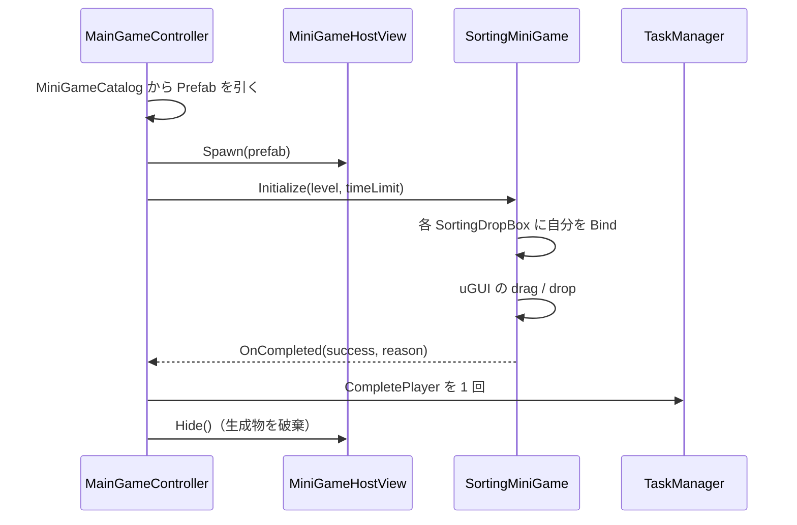

# クラス詳細: 仕分けミニゲーム

最終更新: 2026-08-04  
実装: `Assets/Scripts/MiniGameS/DragDrop/SortingMiniGame.cs`, `SortingDraggable.cs`, `SortingDropBox.cs`  
Prefab: `Assets/Prefabs/MiniGames/SortingMiniGame.prefab`

## 責務

Motonaga の仕分け試作を本編の `TaskKind.DragDrop` へ取り込んだもの。uGUI のドラッグイベントだけを使い、2D / 3D の物理演算は使わない。試作元は変更していない。

## 公開契約

| API / イベント | 意味 |
| --- | --- |
| `SortingDraggable` | カード 1 枚を掴んで動かす。どの箱にも入らなければ元の位置へ戻す。 |
| `SortingDropBox.OnDrop` | 落とされたカードを受け、正誤の判断を `SortingMiniGame` へ渡す。 |
| `SortingMiniGame.Drop` | 正解のカードを取り除く。許容ミス数に達すると `MISSED` で終了し、全部片付くと `COMPLETE` で終了する。 |

正誤は、カードと箱が同じ `categoryId`（文字列）を持つかどうかで決まる。カードと箱を増やす場合は Prefab に置いてから `SortingMiniGame` の配列へ追加する。

## ライフサイクル

## 設定

| 項目 | 場所 |
| --- | --- |
| 制限時間 | `Assets/Data/MiniGameCatalog.asset` の `DragDrop` 行 |
| 箱とカードの配置・枚数・見た目 | Prefab の子（`InboxBox` / `ArchiveBox` / `Card_*`） |
| 正解の対応 | 各 `SortingDropBox` と `SortingDraggable` の `categoryId` |
| 許容ミス数 | Prefab 上の `SortingMiniGame` |

## 現在のルールと TODO

- カード 3 枚を 2 つの箱（`INBOX` / `ARCHIVE`）へ仕分ける。試作から取った小さな縦切りである。
- 2 回入れ間違えると失敗で終わる。試作のミス上限に合わせている。
- TODO: レベル別のカード枚数・ラベル・時間はプレイテストで調整する。現在の構成は暫定である。

## 検証

- Play モードで Game シーンの `DragDrop` タスクから起動できることを確認済み。Console エラー 0 件。
- ドラッグ量は Canvas の拡大率で補正している。1920x1080 以外の解像度でもカードがポインタからずれない。
- TODO: 実機のポインタ操作でドラッグ＆ドロップを手動確認する。
