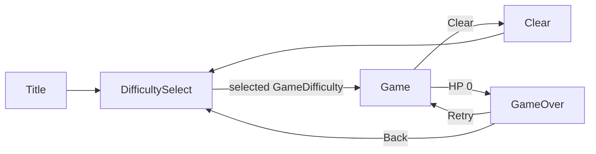
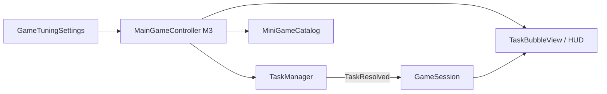
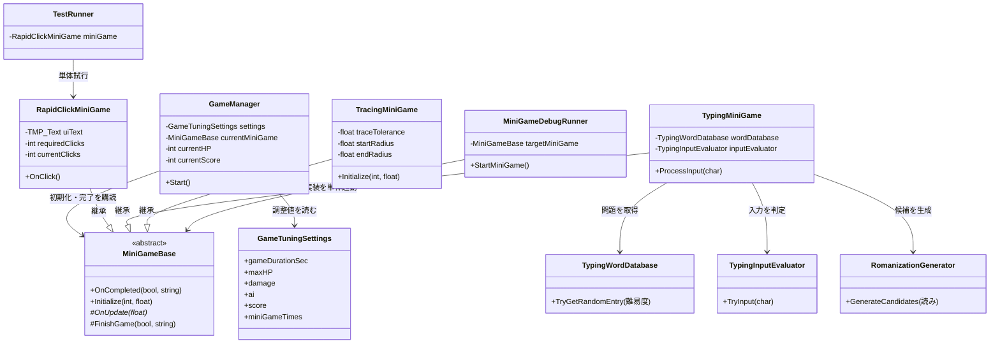
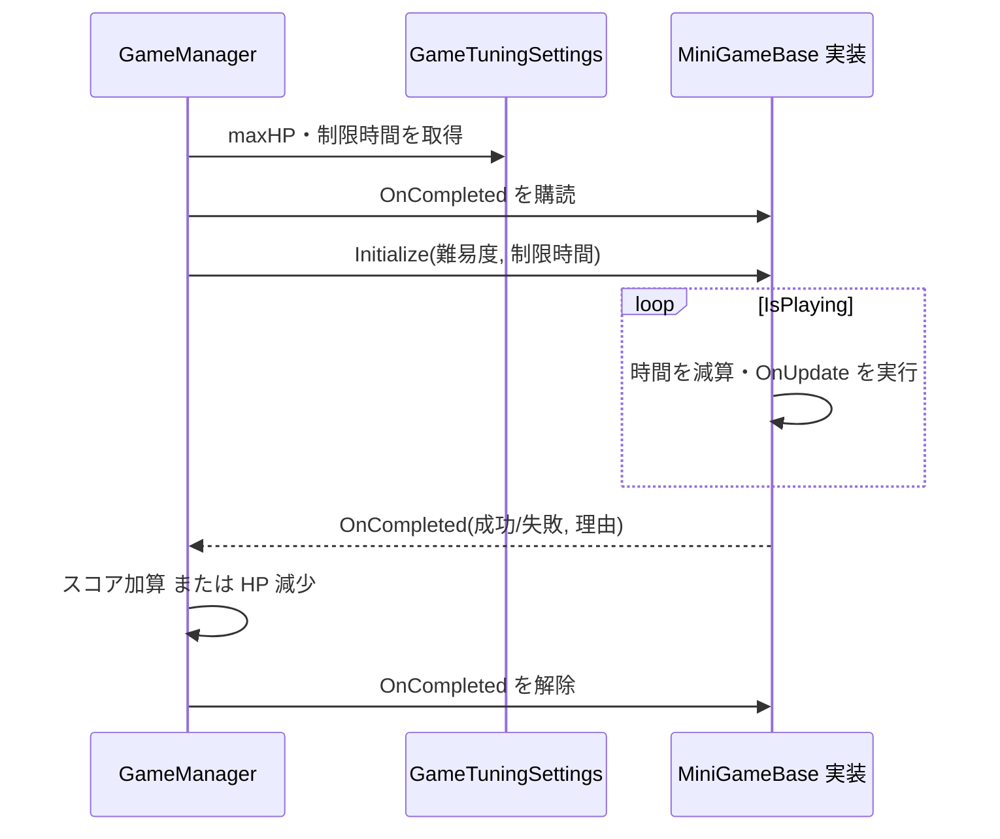

# アーキテクチャ概要

最終確認: 2026-08-03  
対象: 現在 `Assets/Scripts/` にある実装

## 現在の構造

ゲーム全体の状態を `GameManager` が保持し、共通のミニゲーム制御を `MiniGameBase` が提供します。各ミニゲームは `MiniGameBase` を継承して成功・失敗をイベントで通知します。調整値は `GameTuningSettings` ScriptableObject に集約されています。個人試作領域には、同じ共通契約を利用するタイピングミニゲーム、なぞるミニゲーム、および他のミニゲームにも流用できる単体デバッグランナーがあります。

## M2: Scene flow and Canvas foundation (2026-08-03)

Each shared scene has one `UiBootstrap` GameObject authored through Unity Pipeline. At runtime `SceneUiBootstrap` creates the overlay Canvas and its functional P0 controls. `GameFlowController` persists between scene loads and owns the selected difficulty / final session result. This keeps the initial scene assets small while allowing M6 to replace only the View construction and detailed layout.

## M1: Shared game progression model (2026-08-03)

`Overwork.Core` is the UI-independent progression layer. M3's `MainGameController` will create `TaskManager` and `GameSession`, apply each `TaskResolved` notification to the session, then update the HUD and scene transition. Task display, Prefab creation, and input stay outside this layer.

## 実行時フロー

## 依存方向と境界

| 層 / 役割 | 置き場所 | 依存してよいもの | 依存させないもの |
| --- | --- | --- | --- |
| 進行管理 | `Assets/Scripts/Core/` | 設定値、ミニゲーム共通契約 | 個別ミニゲームの実装詳細 |
| ミニゲーム共通契約 | `Assets/Scripts/Core/` | Unity 基盤 | `GameManager`、個別ゲーム |
| 個別ミニゲーム | `Assets/Scripts/<Feature>/` | `MiniGameBase`、必要な UI / Input | 他の個別ミニゲーム |
| 調整データ | `Assets/Data/` | ScriptableObject 定義 | シーン固有オブジェクト |
| 試験・試作 | `Assets/Personal/` または明示的なテスト用領域 | 対象機能 | 製品コードの恒久的な制御 |

## 拡張時の指針

1. ミニゲームを追加する場合は `MiniGameBase` を継承し、成功・失敗の通知は `FinishGame` に統一する。
2. 共有の調整値は `GameTuningSettings` へ追加する前に、全ミニゲームで共有する値か個別データかを判断する。個別の値は個別 ScriptableObject を検討する。
3. `GameManager` が個別ミニゲームの種類を直接判定する分岐は増やさない。選択・遷移が必要になったら専用の選択／進行コンポーネントを導入する。
4. 新しい責務または依存を足したら、この図、カタログ、必要に応じて詳細ページを更新する。

## 個人試作: Suzuki のタイピングミニゲーム

`Assets/Personal/Suzuki/TypingMiniGame/` は、本編の `GameManager` や既存ミニゲームを変更しない独立した試作領域である。`TypingMiniGame` は `MiniGameBase` の共通ライフサイクルのみを利用し、単語データ、ローマ字候補生成、入力判定、表示を分離する。`MiniGameDebugRunner` は対象の `MiniGameBase` を Inspector で差し替えられるため、後から追加する別ミニゲームの単体確認にも使用できる。

## 個人試作: Suzuki のなぞるミニゲーム

`Assets/Personal/Suzuki/TracingMiniGame/` は、本編へ依存を追加しない独立した試作領域である。`TracingMiniGame` は `MiniGameBase` の共通タイマーと完了通知を利用し、New Input System の `Mouse.current` で入力を取得する。固定経路までの最短距離と開始／終点半径を判定し、逸脱 2 回で失敗、終点到達で成功を通知する。デバッグ UI は `SuzukiTracingDebug.unity` 上で実行時に構築する。

## 未確定事項

- TODO: 企画書・仕様書を受領後、ゲームループ、難易度、AI、スコアの正式な定義を確定する。
- TODO: ミニゲームの選択・連続遷移・終了条件を担うコンポーネントの要否を決める。
