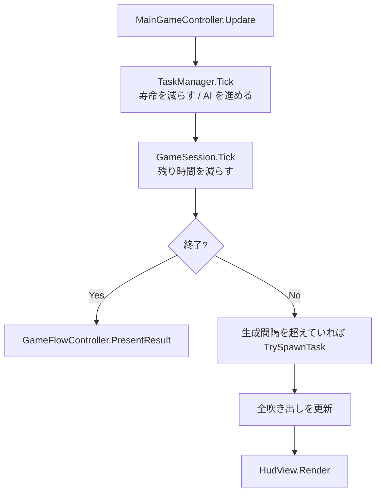
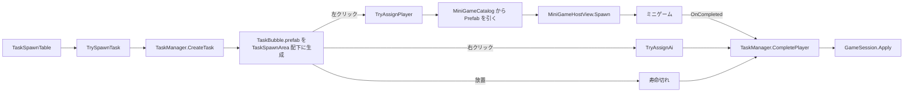
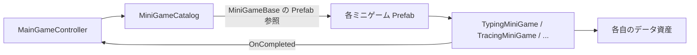
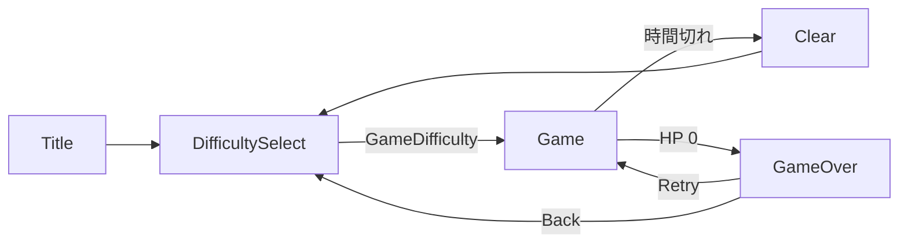

# アーキテクチャ概要

最終確認: 2026-08-04  
対象: 現在 `Assets/Scripts/` にある実装

はじめて読む場合は [シーン構造](scene-structure.md) から読んでください。このページは層の分かれ方と依存の向きを扱います。

## 全体の形

プロジェクトは 4 つの層に分かれる。上の層は下の層に依存してよいが、逆は無い。

| 層 | 置き場所 | 持つもの |
| --- | --- | --- |
| シーンの入口 | `Assets/Scripts/Core/*Manager.cs` | Scene 上の実体への参照と、それを繋ぐ配線だけ |
| 進行制御 | `MainGameController` / `DeviceScreenController` | 生成判断、結果の適用、表示の切替 |
| 進行モデル | `TaskManager` / `GameSession` | 寿命・AI・HP・スコア・終了判定。UnityEngine に依存しない |
| 表示 | `Assets/Scripts/Core/UI/` の各 View、各ミニゲーム | 割り当てられた値を書き込むだけ。座標もサイズも持たない |

見た目の値（位置・大きさ・色・文字・素材）はコードのどの層にも存在しない。Scene と Prefab にある。

## ゲーム 1 フレームの流れ

`MainGameController.Update` が唯一の駆動点である。

`TaskManager` の `TaskResolved` が `GameSession.Apply` を呼ぶ順序により、HP 0 による GameOver が時間切れ Clear より優先される。

## タスク 1 件の流れ

出す面と種別は `TaskSpawnTable`（`Assets/Data/TaskSpawnTable.asset`）が決める。現在は PC にタイピング・仕分け・連打、タブレットになぞりが出る。

## Core と個別ミニゲームの依存の向き

Core は個別ミニゲームのクラスを知らない。`MiniGameCatalog` が `MiniGameBase` 型の Prefab 参照を持つだけである。個別ミニゲームのアセンブリは `Overwork.Core` を参照するが、その逆は無い。

2026-08-04 まではこの間に `IPlayerMiniGameLauncher` と 4 つの Launcher クラスが挟まっていた。Launcher は Prefab を生成して `Initialize` を呼ぶだけの定型文であり、カタログの導入により不要になったため削除した。

## シーン遷移

## 依存方向と境界

| 層 / 役割 | 置き場所 | 依存してよいもの | 依存させないもの |
| --- | --- | --- | --- |
| シーンの入口 | `Assets/Scripts/Core/*Manager.cs` | 各 View、Controller、`GameFlowController` | 個別ミニゲームの実装 |
| 進行制御 | `Assets/Scripts/Core/` | 設定値、進行モデル、`MiniGameCatalog` | 個別ミニゲームの実装詳細 |
| 進行モデル | `Assets/Scripts/Core/` | System のみ | UnityEngine、UI |
| 表示 | `Assets/Scripts/Core/UI/` | uGUI、TextMeshPro | 進行モデルの書き換え |
| 個別ミニゲーム | `Assets/Scripts/MiniGameS/<Feature>/` | `MiniGameBase`、必要な UI / Input、自分のデータ | 他の個別ミニゲーム、Core の内部 |
| 調整データ | `Assets/Data/` | ScriptableObject 定義 | シーン固有オブジェクト |
| 試作 | `Assets/Personal/` | 対象機能 | 本編コードの恒久的な制御 |

## 拡張時の指針

1. ミニゲームを追加する場合は [ミニゲームの追加・改造手順](mini-game-catalog.md) に従う。Prefab とカタログ 1 行だけで完結し、`Game.unity` は触らない。
2. UI 要素を追加する場合は Scene / Prefab に実体を置き、対応する View の `[SerializeField]` に足す。コードで `new GameObject` しない。
3. 共有の調整値は `GameTuningSettings` へ追加する前に、全ミニゲームで共有する値か個別データかを判断する。個別の値は自分の Prefab か個別 ScriptableObject に置く。
4. `MainGameController` にタスク種別やデバイス面ごとの分岐を増やさない。種別ごとの差は `MiniGameCatalog` の行、出現場所の差は `TaskSpawnTable` の行として表す。
5. 新しい責務または依存を足したら、この図とカタログ、必要に応じて詳細ページを更新する。

## 未確定事項

- 難易度ごとの生成間隔・タスク寿命・同時表示上限は 5 難易度とも同じ値である。問題レベルの範囲だけで差を付けている。プレイテストで見直す。
- ミニゲーム中のデバイス切替禁止は暫定仕様である。
- 日本語表示に使う TMP フォントアセットが未作成のため、タイピングの問題文が既定フォントで字形不足の警告を出す。
