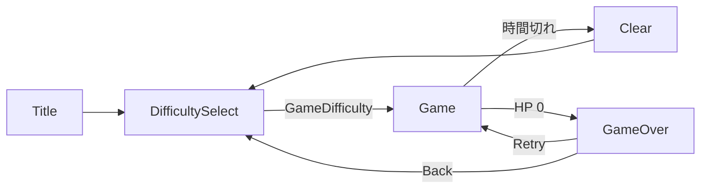

# シーン構造（最初に読む資料）

最終更新: 2026-08-04  
状態: 実装済み。5 シーンすべてがこの形になっている。

このページは「どこを触れば何が変わるのか」を 1 枚で示す。迷ったらまずここを見る。

## 覚えるルールは 2 つだけ

1. **見た目は Scene と Prefab にある。コードには無い。** 位置・大きさ・色・文字・素材は Hierarchy と Inspector で変える。ゲーム進行コードはこれらの値を持たないし、実行時に上書きもしない。
2. **各シーンに `<シーン名>Manager` が 1 つある。そのシーンの入口はそれ。** シーンを開いたらまず同名の GameObject を見る。

実行時に生成するものは次の 3 つだけである。それ以外はすべてシーンか Prefab に実体がある。

- タスク吹き出し（`TaskBubble.prefab`）
- ミニゲーム（`MiniGameCatalog` に登録された Prefab。どの面に出るかは `TaskSpawnTable` が決める）
- なぞりミニゲームのガイド線（経路データで本数が変わるため）

## シーンと入口の対応

| シーン | 入口クラス | 置き場所 | やること |
| --- | --- | --- | --- |
| `Title` | `TitleManager` | `Assets/Scripts/Core/TitleManager.cs` | Start ボタンを難易度選択へつなぐ |
| `DifficultySelect` | `DifficultySelectManager` | `Assets/Scripts/Core/DifficultySelectManager.cs` | ボタンと `GameDifficulty` の対応を持つ |
| `Game` | `GameManager` | `Assets/Scripts/Core/GameManager.cs` | View と `MainGameController` を接続する |
| `Clear` / `GameOver` | `ResultManager` | `Assets/Scripts/Core/ResultManager.cs` | 直前の結果を書き、ボタンをつなぐ |

`Clear` と `GameOver` は同じ `ResultManager` を使う。違いは Inspector の参照だけで、`Clear` では `retryButton` を未設定にする。

各 Manager は `Start` の先頭で `AppServices.Ensure()` を呼ぶ。これで `GameFlowController` と `AudioManager` がそろうため、**どのシーンから再生を始めても動く**。

## シーン遷移



遷移そのものは `GameFlowController` が持つ。シーンをまたいで残るのは、選択中の難易度と直前の結果の 2 つだけである。

## 各シーンの Hierarchy

Title / DifficultySelect / Clear / GameOver は同じ骨格である。

```text
Main Camera
EventSystem
MainCanvas                 ← Screen Space - Overlay / 1920x1080 Scale With Screen Size
└─ ScreenRoot              ← 背景 Image
   ├─ Title / Summary ...  ← TextMeshProUGUI
   └─ 各種 Button
<シーン名>Manager           ← 上表の入口クラスを付けた空の GameObject
```

Game シーンの詳細な Hierarchy は [Game 画面レイアウト案](../GameDesign/game-screen-layout.md) を参照する。

## 常駐サービス

| クラス | 生き方 | 持つもの |
| --- | --- | --- |
| `GameFlowController` | `DontDestroyOnLoad` で 1 個 | 選択難易度、直前の結果、シーン遷移 |
| `AudioManager` | `DontDestroyOnLoad` で 1 個 | BGM / SE の再生、シーンごとの BGM 切替 |
| `AppServices` | `static` クラス | 上 2 つをそろえる `Ensure()` と、共通の決定音 `PlayConfirm()` |

`EventSystem` は常駐させない。各シーンに実体として置き、Hierarchy から見えるようにしている。

## この形になった経緯

2026-08-04 まで、`SceneUiBootstrap` という 1 つのクラスが「常駐サービスの用意」「4 シーンぶんの UI をコードで組み立てる」「Game シーンだけ別扱いにする」の 3 つを兼ねていた。さらにミニゲームは「`UiBootstrap` という GameObject に Launcher コンポーネントを貼ると `GetComponents` で拾われる」という Inspector から読み取れない配線で登録されていた。

この形は、見た目を変えたいときに Scene を見るのかコードを見るのかが対象ごとに逆になり、担当者が構造を把握できなくなっていた。詳細は [実行時 UI 生成の全廃](../Decisions/2026-08-04-remove-runtime-ui-construction.md) を参照。

## 関連資料

- [ミニゲームの追加・改造手順](mini-game-catalog.md)
- [GameManager（Game シーンの配線）](game-manager.md)
- [DeviceScreenController](device-screen-controller.md)
- [クラスカタログ](class-catalog.md)
