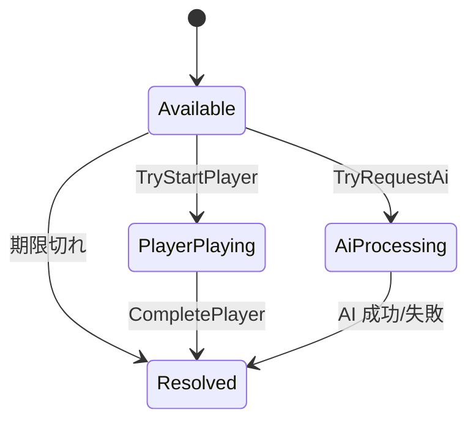

# クラス詳細: TaskManager

最終更新: 2026-08-03  
実装: `Assets/Scripts/Core/TaskManager.cs`  
状態: M1 実装済み

## 責務

`TaskManager` は、メインゲームで発生するタスクの状態遷移だけを管理する。UI、Scene、MonoBehaviour、ミニゲーム Prefab の生成は扱わず、M3 の `MainGameController` と `TaskBubbleView` がこのクラスを利用する。

## 主な API

| API / Event | 入力 | 結果 |
| --- | --- | --- |
| `CreateTask` | 種別、画面、レベル、期限 | `Available` 状態の `TaskInstance` を生成する |
| `TryStartPlayer` | task ID | 残り期限比を記録し、期限を停止して `PlayerPlaying` にする |
| `TryRequestAi` | task ID | クールタイムを満たす場合に AI 処理を開始する |
| `CompletePlayer` | task ID、成功可否 | プレイヤー担当タスクを一度だけ解決する |
| `Tick` | delta time | 未着手タスクの期限と AI 処理時間を進める |
| `TaskResolved` | `TaskResolutionResult` | 解決時に一度だけ通知する |

## 状態遷移

- `PlayerPlaying` と `AiProcessing` 中は、元のタスク期限を停止する。
- 初期値 `ai.cooldownSec = 0` のとき、複数のタスクを同時に `AiProcessing` へ移せる。正の値にすれば全体の AI 依頼クールタイムを再有効化できる。
- `Resolved` タスクは再解決できない。

## 関連クラス

| クラス | 役割 |
| --- | --- |
| `TaskModel` | 難易度・タスク種別・状態・解決理由と `TaskInstance` を定義する |
| `GameSession` | `TaskResolutionResult` を HP・スコア・終了判定に反映し、`GameSessionResult` を作成する |
| `GameTuningSettings` | M3 が `TaskManagerSettings` を組み立てる元となる設定アセット |
| `MiniGameCatalog` | タスク種別に対応する Prefab と制限時間を取得する ScriptableObject |

## テスト

`Assets/Tests/EditMode/TaskManagerTests.cs` で、ゼロクールタイムの同時依頼、プレイヤー開始時の期限停止、期限切れの一度だけの解決、GameOver 優先を検証する。
