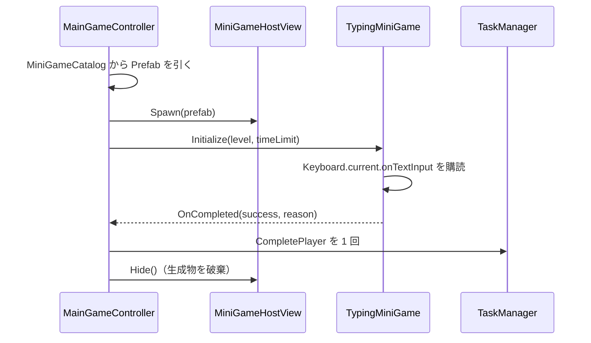

# クラス詳細: タイピングミニゲーム

最終更新: 2026-08-04  
実装: `Assets/Scripts/MiniGameS/Typing/TypingQuestionDatabase.cs`, `RomanizationGenerator.cs`, `TypingInputEvaluator.cs`, `TypingMiniGame.cs`  
Prefab: `Assets/Prefabs/MiniGames/TypingMiniGame.prefab`

## 責務

タイピング問題データ、読みからのローマ字生成、前方一致の判定、画面表示を持つ。

## 問題データが持つのは読みだけである

**ローマ字は問題データに書かない。** 読み（ひらがな）から `RomanizationGenerator` が実行時に全部作る。

```text
「新聞」 + 読み「しんぶん」
   -> shinbun / sinbun / shinnbun / sinnbun / cinbun / … 36 通り
```

訓令式とヘボン式の違い、促音の打ち方（`gakkou` / `gaxtukou` / `galtukou`）、撥音の打ち方（`n` / `nn` / `xn` / `n'`）、拗音の打ち方（`kya` / `kilya` / `kixya`）はすべて生成側が持つ。問題を足す人は読みを 1 つ書くだけでよい。

代表の綴りは候補の先頭に置く。`TypingInputEvaluator` が先頭を画面の「ローマ字」表示に使うため、ここが辞書順の先頭（`cinbun` のような綴り）になると読めない表示になるからである。

## 公開契約

| API / イベント | 意味 |
| --- | --- |
| `TypingQuestionDatabase.TryGetRandomQuestion` | レベル 1〜4 の有効な問題を 1 件選ぶ。 |
| `TypingQuestionDatabase.FindUnplayableQuestions` | 読みからローマ字を作れない問題を列挙する。出題を待たずに不備を見つけるために使う。 |
| `RomanizationGenerator.TryGenerate` | 読みから打てる綴りをすべて作る。先頭が代表。作れない場合は理由を返し、例外は投げない。 |
| `TypingInputEvaluator.TryInput` | 候補のいずれかの前方一致を保つ入力だけを受け付ける。 |
| `TypingMiniGame.ProcessInput` | 入力進捗を更新する。許容ミス数に達すると `MISSED` で終了する。 |
| `MiniGameBase.OnCompleted` | 成功・失敗を 1 回だけ通知する。時間切れは基底クラスが通知する。 |

## ライフサイクル



## データと設定

| 項目 | 場所 |
| --- | --- |
| 問題集 | Prefab 上の `TypingMiniGame.database`（実体は `Assets/Data/MiniGames/Typing/TypingQuestionDatabase.asset`、レベルごとに 8 件以上・計 32 件）。1 行が持つのは **レベル・お題・読み** の 3 つだけ |
| 制限時間 | `Assets/Data/MiniGameCatalog.asset` の `Typing` 行 |
| 許容ミス数、未入力部分の文字色 | Prefab 上の `TypingMiniGame` |
| 文字サイズ・配置・背景 | Prefab の子（`Title` / `Question` / `Input` / `Status`） |

## 検証と TODO

- EditMode テストが、訓令式とヘボン式の両対応、撥音の `n` / `nn`、促音、長音、未対応文字の扱い、代表の位置を検証している。
- `TypingQuestionDatabaseAssetTests` が、**実際に出題される資産の全 32 問**について読みからローマ字を作れることを検査している。出題は抽選なので、遊んで気づけるとは限らないためである。
- Play モードで Host への生成と 2 ミス失敗の経路を確認済み。
- TODO: IME のオン・オフ両方で実キーボード入力を確認する。
- 既知の問題: 日本語表示に使う TMP フォントアセットが未作成のため、既定フォントでは問題文の字形が不足し警告が出る。
