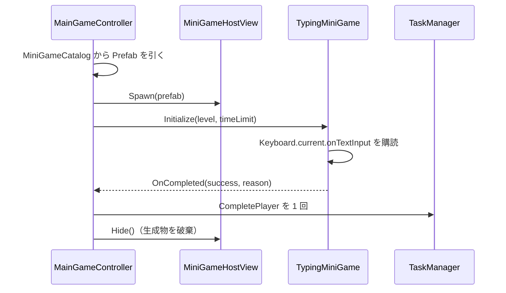

# クラス詳細: タイピングミニゲーム

最終更新: 2026-08-04  
実装: `Assets/Scripts/MiniGameS/Typing/TypingQuestionDatabase.cs`, `TypingInputEvaluator.cs`, `TypingMiniGame.cs`  
Prefab: `Assets/Prefabs/MiniGames/TypingMiniGame.prefab`

## 責務

タイピング問題データ、ローマ字前方一致の判定、画面表示を持つ。`Assets/Personal/` からは独立しており、Suzuki の試作は参考資料としてのみ使用した。

## 公開契約

| API / イベント | 意味 |
| --- | --- |
| `TypingQuestionDatabase.TryGetRandomQuestion` | レベル 1〜4 の有効な問題を 1 件選ぶ。 |
| `TypingInputEvaluator.TryInput` | 許容ローマ字のいずれかの前方一致を保つ入力だけを受け付ける。 |
| `TypingMiniGame.ProcessInput` | 入力進捗を更新する。許容ミス数に達すると `MISSED` で終了する。 |
| `MiniGameBase.OnCompleted` | 成功・失敗を 1 回だけ通知する。時間切れは基底クラスが通知する。 |

## ライフサイクル

## データと設定

| 項目 | 場所 |
| --- | --- |
| 問題集 | Prefab 上の `TypingMiniGame.database`（実体は `Assets/Data/MiniGames/Typing/TypingQuestionDatabase.asset`、レベルごとに 8 件以上・計 32 件） |
| 制限時間 | `Assets/Data/MiniGameCatalog.asset` の `Typing` 行 |
| 許容ミス数、未入力部分の文字色 | Prefab 上の `TypingMiniGame` |
| 文字サイズ・配置・背景 | Prefab の子（`Title` / `Question` / `Input` / `Status`） |

## 検証と TODO

- EditMode テストが代替ローマ字、不正入力、レベル別の問題数を検証している。
- Play モードで Host への生成と 2 ミス失敗の経路を確認済み。
- TODO: IME のオン・オフ両方で実キーボード入力を確認し、プレイテスト結果から許容ローマ字候補を調整する。
- 既知の問題: 日本語表示に使う TMP フォントアセットが未作成のため、既定フォントでは問題文の字形が不足し警告が出る。
