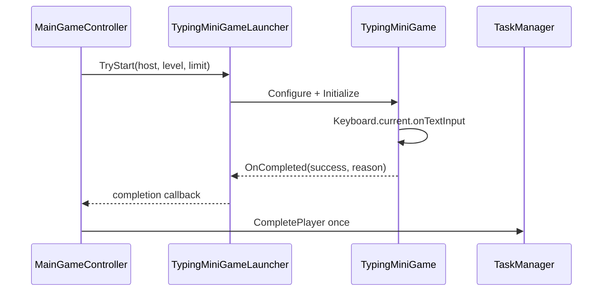

# Class detail: shared typing mini-game

Last updated: 2026-08-03  
Files: `Assets/Scripts/MiniGameS/Typing/TypingQuestionDatabase.cs`, `TypingInputEvaluator.cs`, `TypingMiniGame.cs`, `TypingMiniGameLauncher.cs`

## Responsibility

This feature owns the shared typing question data, Romanization-prefix evaluation, and its temporary runtime UI. It is independent from `Assets/Personal/`; the Suzuki prototype was reference material only.

## Public contract

| API / event | Meaning |
| --- | --- |
| `TypingQuestionDatabase.TryGetRandomQuestion` | Selects one valid question for levels 1-4. |
| `TypingInputEvaluator.TryInput` | Accepts one character only when it remains a prefix of one or more allowed Romanizations. |
| `TypingMiniGame.ProcessInput` | Updates input progress; two rejected inputs finish with `MISSED`. |
| `IPlayerMiniGameLauncher.TryStart` | Starts the feature inside `MiniGameHost` and returns its final result to Core exactly once. |

## Lifecycle

## Data and configuration

- `Assets/Data/MiniGames/Typing/TypingQuestionDatabase.asset` has 32 initial entries: at least eight for every level.
- The Game scene's `UiBootstrap` holds `TypingMiniGameLauncher` and references that asset.
- The game-time limit comes from `GameTuningSettings.miniGameTimes.typing`.

## Verification and TODO

- EditMode tests cover alternative Romanization, invalid-prefix handling, and per-level question count.
- Runtime verification covers host construction and two-miss completion routing.
- TODO: manually verify real keyboard input with both IME on and off, then adjust the allowed Romanization candidates from play-test results.
- TODO: replace the code-generated temporary UI with the M6 hierarchy/Prefab View without changing this launch contract.
