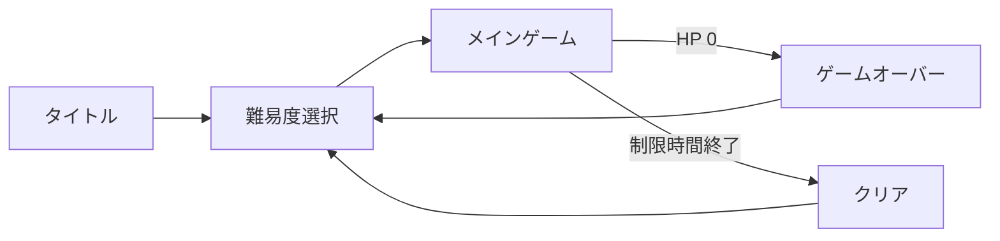

# ゲーム企画概要

> **ステータス: 実装前の合意済み方針（2026-08-03）**
> 本書は受領した「OverWork Yourself - ゲーム企画・仕様書統合版」と、チーム内で合意した実装方針を反映する。数値のバランスと未採用ミニゲームはプレイテスト前の暫定値である。

関連資料: [コアゲームプレイ仕様](../Specifications/gameplay-core.md) / [メインゲーム画面・接続仕様](../Specifications/main-game-flow.md) / [現行アーキテクチャ](../Architecture/overview.md)

## 一言でいうと

深夜の自室で、PC とパッドに次々届く創作タスクを、限られた時間と HP の中で処理するミニゲーム集。プレイヤーは各タスクを自力で解くか、速いが失敗の可能性がある AI へ任せるかを選ぶ。

## テーマと目標体験

| 項目 | 内容 |
| --- | --- |
| テーマ | AI 時代に自分のこだわりを奪われないために。 |
| ターゲット | AI を用いた作品制作の経験があり、創作の主体性に疑問を持つ 10 代後半の学生。 |
| インサイト | 創作に自信を持ちたいが、知識不足から AI に頼り、自分を見失いかけている。 |
| 目標感情 | 焦りの中で選び、小さな成功を積み重ねて「自分にもできる」と感じる。 |

## 画面と 1 プレイの流れ

1. タイトルから難易度を選ぶ。
2. メインゲームで、PC またはパッドに現れるタスク吹き出しを確認する。
3. 左クリックで自力のミニゲームを開始するか、右クリックで AI に依頼する。
4. 自力・AI・放置の結果に応じてスコアまたは HP を変化させる。
5. 制限時間まで HP を残せばクリア、HP が 0 ならゲームオーバーとなる。
6. 結果画面から難易度選択へ戻る。

ポーズとオプションは独立したシーンではなく、各画面に重ねる UI パネルとする。

## メインゲームの体験

- PC とパッドは別々のタスク面である。プレイヤーは切替ボタンでどちらを見るかを選ぶ。
- 非表示側のタスクは見えないが、出現・寿命・AI 処理は継続する。定期的に画面を確認する判断を生む。
- プレイヤーが自力で実行できるミニゲームは同時に 1 件だけである。
- 自力開始したタスクは吹き出し寿命を停止し、固有のミニゲーム制限時間へ移行する。ほかの未処理タスクの寿命は継続する。
- AI は複数のタスクを並行して処理できる。AI 処理中のタスクは再選択できない。

## 難易度

ゲーム難易度と、ミニゲーム内の問題レベルは別の概念である。

| ゲーム難易度 | 問題レベル | 全体時間 | 進行 |
| --- | --- | --- | --- |
| Easy | 1 | 180 秒 | 固定 |
| Normal | 1–2 | 180 秒 | 経過で上昇 |
| Hard | 2–3 | 180 秒 | 経過で上昇 |
| Very Hard | 3–4 | 180 秒 | 経過で上昇 |
| Endless | 1–4 | なし | 一定間隔で上昇し、4 で維持 |

タスク生成間隔・寿命・同時表示数・レベル上昇時刻は `GameTuningSettings` とタスク定義へ集約し、プレイテストで調整する。

## AI と評価

AI は「高速だが確実ではない」選択肢である。初期値は処理時間 0.4 秒、成功率 90%、成功時スコア倍率 60%、クールタイム 0 秒とする。複数タスクを並行処理できる。AI の失敗は HP を減らす。AI を使わないクリアの称号・ランキング・追加コストは初期版の対象外であり、将来の検討事項とする。

## ミニゲームの採用順

| 種類 | 操作 | 位置付け |
| --- | --- | --- |
| タイピング | 日本語単語をローマ字で入力 | P0。問題はレベル別 ScriptableObject で管理する。 |
| なぞり | ガイド線を始点から終点までなぞる | P0。逸脱時に失敗する。 |
| 連打 | 指定回数を素早く押す | P1。既存試作を共有実装へ移植する。 |
| ドラッグ＆ドロップ | 指定位置へ対象を運ぶ | P1。既存試作を共有実装へ移植する。 |
| QTE / タイミング | 指定入力・タイミング入力 | 初期版では未採用。 |

## 表示・入力方針

- 全画面を 2D の Canvas UI として構成し、ゲームプレイに 2D / 3D 物理は用いない。
- ルート Canvas は `Screen Space - Overlay`、基準解像度は 1920×1080、Canvas Scaler は画面サイズ追従とする。
- タスク選択、ドラッグ＆ドロップ、なぞりは EventSystem と Input System のポインターイベントで扱う。
- 背景は深夜の自室、UI はピンク・緑・黄を基調としたネオン調とする。

## 保留事項

- TODO（2026-08-03）: 難易度ごとのタスク生成間隔、寿命、最大同時数、レベル上昇曲線をプレイテストで確定する。
- TODO（2026-08-03）: 結果画面の AI 利用内訳、称号、ランキング、スコア履歴の採用範囲を決める。
- TODO（2026-08-03）: 椅子を回すような画面切替演出、背景素材、フォント、BGM / SE の最終仕様を決める。
- TODO（2026-08-03）: マスター / BGM / SE のどこまでを音量調整対象にするか、設定を保存するか、オプション画面に含める項目を決める。
