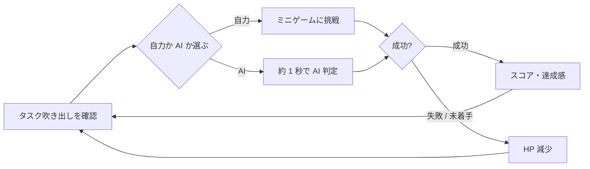

# ゲーム企画概要

> **ステータス: ドラフト（2026-08-03）**  
> この資料は共有された簡易企画資料を基にした、AI・チーム向けの共通理解用です。元資料は最新版ではないため、数値・タスク種別・評価方法は確定仕様ではありません。実装着手前に未確定事項を確認し、決まった内容は本資料と対応仕様へ反映します。

関連資料: [コアゲームプレイ仕様](../Specifications/gameplay-core.md) / [現行アーキテクチャ](../Architecture/overview.md)

## 一言でいうと

深夜の自室で、次々に届く創作タスクを制限時間内に処理するミニゲーム集です。プレイヤーは各タスクを自力でこなすか、すぐ終わる代わりに失敗する可能性がある AI に任せるかを選びます。

## テーマと対象者

| 項目 | 内容 |
| --- | --- |
| テーマ | AI 時代に、自分のこだわりを奪われないために。 |
| ターゲット | 作品制作に AI を使った経験があり、作品が自分のものではなく AI のものになってしまうことに疑問を感じる 10 代後半の学生。 |
| インサイト | 創作に自信を持ちたいが、知識不足から AI に頼り、自分を見失いかけている。 |
| 目指す感情 | 焦りの中で選択し、小さな成功を積み重ね、「自分にもできる」と感じる。 |

## プレイヤー体験の柱

| 遊びやすさの条件 | ゲーム内での表現 | 検証観点 |
| --- | --- | --- |
| 目的が明確 | 制限時間内にタスクを処理し、HP を残して完走する。 | 常に残り時間、HP、優先すべきタスクが見える。 |
| 手段が明確 | 吹き出しを選んでミニゲームを行い、右クリックで AI を使う。 | 操作と結果の対応をチュートリアルなしでも理解できる。 |
| 自分で決められる | タスクごとに自力攻略か AI 代行かを選択する。 | どちらにも有効な局面がある。 |
| 小さな成功体験 | 序盤は短く簡単なミニゲームで成功を重ねる。 | 最初の数タスクで成功を体験できる。 |
| 適度な難度 | 経過時間に応じて難易度・同時タスク数を上げる。 | 終盤に判断と操作の両方が必要になる。 |
| 正当な評価・報酬 | AI と自力の過程・成果を区別して表示・評価する。 | AI を使うことが常に最適解にも、常に罰にもならない。 |

## 1 プレイの概要

1. スタートし、ゲームの残り時間と HP を確認する。
2. 一定間隔で画面上にタスク吹き出しが現れる。アイコンと残りゲージから種類・猶予を判断する。
3. 吹き出しを選ぶと、PC 画面に対応するミニゲームが表示される。
4. 自力で成功を狙うか、右クリックで AI に即時代行させるかを決める。
5. 成功ならスコアを得る。ミニゲーム失敗または未着手の時間切れなら HP を失う。
6. 制限時間まで耐えればクリア、HP が 0 になればゲームオーバーとなる。

詳細な状態・判定は [コアゲームプレイ仕様](../Specifications/gameplay-core.md) を正とします。

## コアループ

## ミニゲーム候補

| 種類 | 基本操作 | 企画上の狙い | 状態 |
| --- | --- | --- | --- |
| タイピング | 指定語を入力 | 知識・言葉を自分で出す感覚 | 候補 |
| タイミング | 適切な瞬間に入力 | 集中とリズム | 候補 |
| ドラッグ＆ドロップ | 左の箱から右の箱へ運ぶ | 直感的な整理・配置 | 候補 |
| なぞる | 表示された線をなぞる | 手で形を作る感覚 | 候補 |
| 連打 | 指定回数を素早く押す | 緊急性 | 実装サンプルあり |
| QTE | 指定キーを制限内に押す | 瞬発的な反応 | 候補 |

全種を実装するか、採用順・日本語入力の要件は未確定です。

## 世界観・ビジュアル方針

- 舞台は深夜の自室。背景は暗く、作業中の孤独と時間的な焦りを表現する。
- タスク吹き出し、UI、操作対象にはピンク・緑・黄などのビビッド／ネオンカラーを使い、優先順位と操作対象を際立たせる。
- AI は便利で魅力的に見せつつ、プレイヤーの選択と成果を覆い隠さない演出にする。

## 未確定事項

- TODO: AI での成功と自力成功を、最終評価・スコア・演出のどこで、どの程度区別するか決める。
- TODO: 1 プレイの正式な時間、初期 HP、難易度曲線をプレイテストで定める。
- TODO: ミニゲームの採用数、実装優先順位、キーボード／マウス操作の正式方針を定める。
- TODO: クリア・ゲームオーバー後に表示する結果画面と、テーマを伝える締めの演出を定める。
