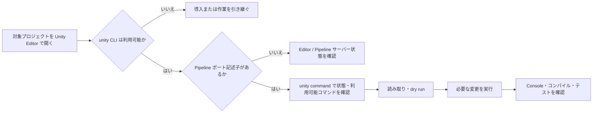

# Unity CLI / Pipeline 運用

最終確認: 2026-08-06

## 前提

- 実際に開いている Editor は `6000.3.21f1`（`editor_status` の `unityVersion` で確認）。
- **`ProjectSettings/ProjectVersion.txt` は `6000.4.4f1` を指しており、開いている Editor と一致していません。** `unity test` はこの記述からインストール済み Editor を探すため起動できません。テストは `unity command run_tests` を使います（後述）。
- `Packages/manifest.json` で `com.unity.pipeline: 0.4.0-exp.1` を確認済み。
- PipelinePackage は Unity Editor をローカル HTTP API として公開し、Unity CLI の `unity command` がそこへ接続する構成。
- この確認環境では `unity` コマンドは検出されませんでした。一方、開いている Editor が作る `Library/Pipeline/.unity-pipeline-port` は存在します。**各メンバーは作業環境で CLI の有無を確認すること。**

## 接続前チェック

PowerShell では、プロジェクトルートで次を順に確認します。

```powershell
Get-Command unity -ErrorAction SilentlyContinue
Test-Path Library/Pipeline/.unity-pipeline-port
unity command --project-path "$PWD"
```

1 行目で何も出なければ Unity CLI が未導入または PATH 未設定です。2 行目が `False` なら Unity Editor が対象プロジェクトを開いていない、または Pipeline サーバーが起動していない可能性があります。3 行目は接続できれば利用可能なコマンドを表示します。

CLI の導入は、利用する Unity CLI の公式手順に従ってください。PipelinePackage の README に記載された Windows 用の例は次のとおりです。

```powershell
$env:UNITY_CLI_CHANNEL='beta'; irm https://public-cdn.cloud.unity3d.com/hub/prod/cli/install.ps1 | iex
```

このインストールはローカル環境を変更するため、各メンバーが必要性を確認した上で実施します。導入後は新しいシェルを開き直して `Get-Command unity` を再実行してください。

## 基本フロー



代表例（`<project-path>` は絶対パスに置き換えます）。

```powershell
unity command --project-path "<project-path>" editor_status
unity command --project-path "<project-path>" recompile_status
```

実際に利用できるコマンド・引数は PipelinePackage のバージョンで異なるため、最初に `unity command --project-path "<project-path>"` の出力を確認して決めます。

## 安全な操作

- 変更前に対象アセット・シーン・設定の現在値を読み取る。
- `dry_run` がある変更コマンドは必ず先にプレビューする。
- 削除・上書き・設定変更の `confirm=true` は、対象と影響を確認してから指定する。
- 接続先はローカル Editor のみ。Pipeline サーバーは loopback にバインドされます。
- domain reload、ビルド、ターゲット切替の途中は一時的に接続が切れることがあるため、状態確認コマンドで完了を待つ。

## eval_file とシーン編集

任意の Editor 用 C# は `eval_file` で実行します。

```powershell
unity command --project-path "<project-path>" eval_file --file "<script.cs>"
```

**渡すファイルはメソッドの本体です。** `using` も `class` も書けません。型は完全修飾で書き、`string` を `return` します。

```csharp
// これで 1 ファイルぶんの全体。using も class も書かない。
var log = new System.Text.StringBuilder();
var scene = UnityEditor.SceneManagement.EditorSceneManager.OpenScene(
    "Assets/Scenes/Game.unity", UnityEditor.SceneManagement.OpenSceneMode.Additive);
log.AppendLine("開いた: " + scene.name);
UnityEditor.SceneManagement.EditorSceneManager.CloseScene(scene, true);
return log.ToString();
```

シーンやアセットの値を変えるときは、次の 4 つを最後まで行います。**どれか欠けると保存されず、保存されなかったこと自体にも気づけません。**

```csharp
var so = new UnityEditor.SerializedObject(component);
so.FindProperty("dimAlpha").floatValue = 0f;
so.ApplyModifiedPropertiesWithoutUndo();       // 1. 適用
UnityEditor.EditorUtility.SetDirty(component); // 2. 変更済みの印
UnityEditor.SceneManagement.EditorSceneManager.MarkSceneDirty(scene);
UnityEditor.SceneManagement.EditorSceneManager.SaveScene(scene); // 3. 保存
// 4. 開き直して読み直し、値が入っているか確かめる
```

Prefab から作られたオブジェクトを変えた場合は、シーン側の上書きで終わらせず
`UnityEditor.PrefabUtility.ApplyPropertyOverride` で Prefab へ戻します。同じ Prefab を使う
他のシーンに反映されないためです。

再生中の挙動を測るときは、`UnityEditor.EditorApplication.update` に閉包を登録して
`StringBuilder` へ書き溜め、目印を付けて `Debug.Log` し、`get_console_logs` で読み戻します。
非アクティブなオブジェクトは `FindObjectsByType` の既定では拾えないため、
`UnityEngine.FindObjectsInactive.Include` を指定します。

## よくある問題

| 症状 | 確認・対応 |
| --- | --- |
| `unity` が見つからない | CLI 未導入または PATH 未設定。導入後に新しいシェルで再確認する。 |
| `unity test` が「エディターがインストールされていません」で止まる | `ProjectVersion.txt` が開いている Editor と食い違っている。`unity command run_tests --mode EditMode` を使う。 |
| コンソール出力が文字化けする | シェルの既定コードページが cp932。`PYTHONIOENCODING=utf-8` を付けるか、JSON をファイルに書き出してから読む。 |
| `delete_asset` が実行されない | 引数は `--path` ではなく `--asset`。加えて `--confirm true` が要る。 |
| ポート記述子がない | 対象プロジェクトを Unity Editor で開く。必要なら Pipeline メニューからサーバーの状態を確認する。 |
| 接続に失敗する | project path が対象と一致するか、Editor が起動中かを確認する。接続先は `localhost` ではなく Pipeline が自動検出する設定を使う。 |
| 操作後に応答しない | 再コンパイル・domain reload・ビルド中の可能性がある。少し待って `editor_status` / 対応する `*_status` を確認する。 |

## 参照

- パッケージ同梱資料: `Library/PackageCache/com.unity.pipeline@*/README.md`
- 接続仕様: `Library/PackageCache/com.unity.pipeline@*/Documentation~/connectivity.md`
- コマンド一覧: `Library/PackageCache/com.unity.pipeline@*/Documentation~/index.md`
