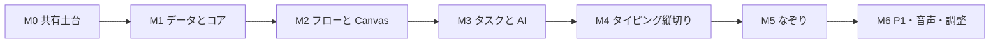

# メインゲーム実装計画

> **ステータス: 実装開始前の合意済み計画（2026-08-03）**

企画: [ゲーム企画概要](../GameDesign/game-overview.md)
仕様: [コアゲームプレイ仕様](../Specifications/gameplay-core.md) / [メインゲーム画面・接続仕様](../Specifications/main-game-flow.md)

## 1. 目的と完了像

本計画は、個別試作を壊さずに、`Title → DifficultySelect → Game → Clear / GameOver → DifficultySelect` を通して遊べる初期版を作る手順を定義する。

P0 の完了像は以下である。

1. Canvas UI の PC / パッドにタスクが発生し、非表示側も時間が進む。
2. 左クリックでタイピングまたはなぞりを自力開始できる。
3. 右クリックで AI を依頼でき、複数タスクを並行処理できる。
4. HP、スコア、ポーズ、通常難易度のクリア、ゲームオーバー、Endless が仕様どおり動く。
5. `Assets/Personal/` の原本を変更せず、共有領域だけで実行できる。

## 2. 実装範囲

| 優先度 | 対象 | 方針 |
| --- | --- | --- |
| P0 | 5 シーン、ゲームループ、タスク、AI、HUD、ポーズ | 本計画の必須範囲。 |
| P0 | タイピング、なぞり、AudioManager の基盤 | 最初の遊べる版に含める。音源自体は後から差し替え可能にする。 |
| P1 | 連打、ドラッグ＆ドロップ | Personal 原本から本番実装へ移植してカタログへ追加する。 |
| P2 | QTE、タイミング、ランキング、称号、スコア履歴、椅子回転演出 | P0 の完成後に仕様を再確認して扱う。 |

## 3. 共通ルールと作業境界

### 3.1 アセットとコード

```text
Assets/
  Scenes/                         # 共有シーンのみ
  Scripts/
    Core/                         # 進行、タスク、入力、音声
    MiniGames/Typing/
    MiniGames/Tracing/
    MiniGames/RapidClick/
    MiniGames/DragDrop/
  Data/
    Game/
    MiniGames/Typing/
    MiniGames/Tracing/
  Prefabs/
    UI/
    MiniGames/
```

- `Assets/Personal/` は読み取り専用の原本として扱い、編集、移動、削除をしない。
- シーン、Prefab、ScriptableObject、素材の複製・作成・移動は Unity Pipeline を使う。
- C# は同一クラス名を複製せず、本番用の新規クラスとしてロジックを移植する。
- 3D / 2D Physics、Collider、個別ミニゲームへの直接分岐、個別シーンへの遷移は導入しない。

### 3.2 シーン台帳

| シーン | 作り方 | 完了時の役割 |
| --- | --- | --- |
| `Assets/Scenes/Title.unity` | 既存共有シーンを構築 | 開始、オプション、終了。 |
| `Assets/Scenes/DifficultySelect.unity` | 新規作成 | 5 難易度の選択とタイトルへ戻る。 |
| `Assets/Scenes/Game.unity` | 既存共有シーンを構築 | ルート Canvas、HUD、PC / パッド、Host、ポーズ。 |
| `Assets/Scenes/Clear.unity` | 新規作成または Personal 原本から複製 | CLEAR、結果、難易度選択へ戻る。 |
| `Assets/Scenes/GameOver.unity` | 既存共有シーンを構築 | GAME OVER、結果、リトライ、戻る。 |

Build Settings は 5 シーンを確認してから置き換える。Personal 配下のシーンはビルド対象から外すが、削除はしない。

## 4. 段階計画

### M0: 作業可能な共有土台

**目的:** 本番アセットと Personal 原本を確実に分離し、Unity 操作の出発点を固定する。

- Pipeline で本番用フォルダと `DifficultySelect` / `Clear` シーンを作成する。
- 既存 `Title`、`Game`、`GameOver` の現在内容を読み取り、共有シーンとして使用可能か確認する。
- `GameTuningSettings.asset` を移動せず、共有データの参照先として維持する。
- 新しいシーンの Canvas、Canvas Scaler、EventSystem は M2 で作る。M0 では空シーンでよい。
- 5 シーンすべてが保存できた時点で Build Settings を更新する。

**確認ゲート:** Pipeline の `list_open_scenes`、`get_build_settings`、`recompile_status`、Console エラー 0 件。Git LFS の一時ファイルによって `git status` が失敗する場合は、LFS 一時ファイルを操作せず、Editor 終了後に再確認する。

### M1: データモデルとゲーム進行のコア

**目的:** UI や個別ミニゲームを持たずに、タスクの状態遷移と結果計算を正しく扱えるようにする。

実装対象は次のとおり。

| 型 / アセット | 責務 |
| --- | --- |
| `GameDifficulty` | Easy、Normal、Hard、VeryHard、Endless を表す。 |
| `TaskKind` / `TaskSurface` | ミニゲーム種別と PC / パッドの配置面を表す。 |
| `TaskState` / `TaskResolution` | 未着手、自力実行中、AI 処理中、解決済みと、5 種の解決結果を表す。 |
| `TaskInstance` | 生成ごとの ID、問題レベル、寿命、確定済み速度ボーナスを保持する実行時データ。 |
| `GameTuningSettings` 拡張 | 難易度プロファイル、生成間隔、寿命、同時表示上限、問題レベル曲線、レベル 4 基礎点を持つ。 |
| `MiniGameCatalog` | タスク種別、アイコン、Prefab、レベル別制限時間を対応付ける ScriptableObject。 |
| `GameSessionResult` | 難易度、最終スコア、HP、各解決数、AI 使用数を結果画面へ渡す。 |

`TaskManager` は時間の更新、生成、AI クールダウン、AI 判定、1 回だけの解決を担当する。`MainGameController` は TaskManager の結果を受けて HP、スコア、全体時間、終了を管理する。ランダム値と時刻はテストで差し替えられる境界を持たせる。

**確認ゲート:** EditMode テストで、寿命切れ、自力開始時の寿命停止、AI クールダウン、AI の複数処理、二重解決防止、速度ボーナス、HP 0 優先、Endless の非クリアを検証する。C# 変更後は Pipeline の再コンパイルと Console を確認する。

### M2: フローと Canvas UI の骨格

**目的:** 5 シーンと Main Game の表示責務を接続する。

- `GameFlowController` を唯一のセッション入口とし、選択難易度と `GameSessionResult` をシーン間で保持する。
- `Title`、`DifficultySelect`、`Clear`、`GameOver` に最小限のボタンと表示を置く。
- `Game` に `HudPanel`、`PcTaskPanel`、`PadTaskPanel`、`MiniGameHost`、`PausePanel`、`OptionPanel` を置く。
- PC / パッドの表示切替は `CanvasGroup` の alpha、interactable、blocksRaycasts をまとめて変更する。タスクのモデル更新は UI の可視状態に依存させない。
- Input System の UI モジュールを確認し、Esc を `InputRouter` 経由でポーズへ接続する。
- `AudioManager` と空の `AudioCatalog` を追加する。BGM / SFX の AudioSource を分け、クリップ未設定時は無音で終了する。

**確認ゲート:** Title から全難易度を選択して Game に入れる。Esc で時間が止まり、再開・難易度選択へ戻るが動く。Clear / GameOver から DifficultySelect に戻る。画面サイズを変えても Canvas の主要 UI が読める。

### M3: タスク UI と AI の縦切り

**目的:** ミニゲームを起動せずとも、タスクを発生・選択・AI 処理・失効できるようにする。

- `TaskBubbleView` Prefab にアイコン、問題レベル、寿命ゲージ、AI 処理中表示を置く。
- `TaskManager` の `TaskInstance` と PC / パッドの各 View を 1 対 1 で結び、生成・破棄を同期する。
- 左クリックは `MiniGameHost` へ起動要求を出し、Host が空でない場合は受け付けない。
- 右クリックは AI 依頼を行い、クールダウン中・解決済み・実行中のタスクを拒否する。
- 結果ごとの HP、スコア、SFX 要求を MainGameController から UI / AudioManager へ通知する。

**確認ゲート:** PC / パッドの両方にタスクが生成される。非表示側が期限切れになる。AI を別々のタスクへ順に依頼できる。失効、AI 成功、AI 失敗が 1 回だけ反映され、HP 0 で即座に GameOver になる。

### M4: タイピングの本番移植と最初の通しプレイ

**目的:** P0 の最初の自力ミニゲームを接続し、開始から結果までの通しプレイを成立させる。

- `Assets/Personal/Suzuki/TypingMiniGame/` を参照し、`RomanizationGenerator`、入力判定、View を本番用の新規クラスへ移植する。
- `TypingQuestionDatabase` を作成し、4 レベル各 8〜10 問を登録する。問題が不足する間は設定不備を隠すフォールバックを実装しない。
- タイピング Canvas Prefab を `MiniGameHost` に接続する。
- 自力開始時に寿命を停止し、`MiniGameBase.OnCompleted` を TaskManager の自力解決へ 1 回だけ戻す。
- Easy のテスト用プロファイルで短い全体時間を使えるようにし、本番値 180 秒を変更せずに素早く通し確認できるようにする。

**確認ゲート:** 自力成功・2 ミス失敗・時間切れ・AI 代行・未着手失効のすべてで、Host の破棄、HP / スコア、結果画面への遷移が正しい。問題レベルとゲーム難易度の対応がデータどおりである。

### M5: なぞりの実装と接続

**目的:** Canvas 座標だけで成立する第二の P0 ミニゲームを追加する。

- `TracingPathDatabase` とレベル別経路データを作成する。
- `TracingMiniGame`、ガイド線描画、チェックポイント進捗、逸脱判定、離脱判定を実装する。
- `RectTransformUtility` で Screen 座標を Canvas ローカル座標へ変換し、Canvas Scaler に依存しない判定にする。
- `MiniGameCatalog` に追加し、タスク生成候補へ含める。

**確認ゲート:** 始点外クリック、正しい完走、許容距離超過、途中離脱、時間切れを確認する。異なる解像度でも見た目と判定が一致する。

### M6: P1 ミニゲーム、音声素材、演出、バランス

**目的:** 既存試作を安全に移植し、初期版をプレイテスト可能な状態へ近づける。

- 連打とドラッグ＆ドロップを新規本番クラス・Prefab として移植し、`MiniGameCatalog` へ登録する。
- BGM / SE を `AudioCatalog` に登録し、開始、タスク発生、AI、成功、失敗、HP、ポーズ、結果へ接続する。
- 難易度プロファイルの生成間隔、寿命、上限、レベル曲線、スコアをプレイテストで調整する。
- フェード、吹き出しゲージ、画面揺れ、スコア表示の優先度を再評価する。

**確認ゲート:** P0 / P1 の各カタログ項目が同じ接続契約で動く。全難易度と Endless の開始・終了条件、音量操作、1 プレイ後の状態初期化を確認する。

## 5. 実装順の依存関係



M4 完了時点が最初の「通しで遊べる版」である。M5 はユーザー要求のなぞり通常版を満たす必須段階、M6 の連打・ドラッグ＆ドロップは追加接続段階とする。

## 6. 数値調整の扱い

コードには難易度値を直接書かない。以下は `GameTuningSettings` と対応カタログへ置く。

- 初期 HP、通常難易度の全体時間、Endless の上昇間隔。
- タスク生成間隔、寿命、PC / パッドごとの同時表示上限。
- 問題レベルの開始値・上限・上昇時刻。
- 問題レベル別の基礎点、速度ボーナス、AI 成功率・処理時間・クールダウン・倍率。
- 各ミニゲームのレベル別制限時間と判定しきい値。

実装の初期値には現行仕様の 180 秒、HP 100、AI 0.4 秒・90%・0.60 倍、失敗 -5、失効 -8 を使う。生成間隔・寿命・同時表示上限の正式値は M6 のプレイテストで決定する。

## 7. 各変更の検証とコミット単位

- C# 変更ごとに Pipeline の `recompile_status` と Console を確認する。
- Scene / Prefab / ScriptableObject の変更前には Pipeline の読み取りコマンドを実行し、書き込みは対象ごとに行う。
- M1 は EditMode テスト、M2 以降は対象シーンの Play Mode 確認を必須とする。
- M0〜M6 をまたぐ大きな変更はしない。各 M の確認ゲートを満たしてから次へ進む。
- コミット前には `git status` を確認する。Git LFS の一時ファイルが Editor によりロックされている場合は、Editor を閉じた後に再確認し、`.git/lfs/tmp/` を直接操作しない。

## 8. 実装開始条件

M0 を開始する前に、以下を満たすこと。

1. 本計画、コア仕様、メインゲーム仕様の間に矛盾がないこと。
2. `Assets/Personal/` を原本として扱う方針に合意していること。
3. Unity Editor が対象プロジェクトを開き、Pipeline ポートが存在すること。
4. 現在のコードが再コンパイル可能で、Console にエラーがないこと。

現時点では 1、2、3、4 を満たす。Git LFS による status 確認だけは、Editor がロックを解放するまで引き継ぎリスクとして残る。
