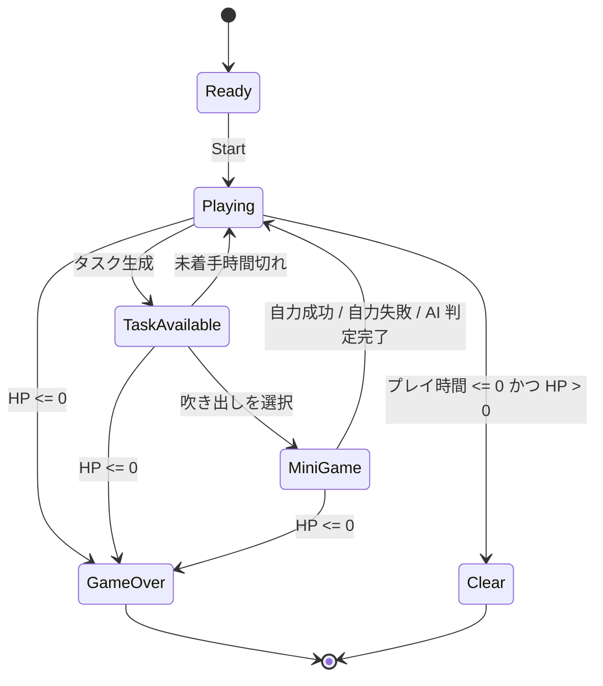

# コアゲームプレイ仕様

> **ステータス: ドラフト（2026-08-03）**  
> 企画の最新版ではない簡易資料を構造化した初版です。`要確認` と `TODO` の項目は、実装上の恒久仕様として扱わないでください。

企画: [ゲーム企画概要](../GameDesign/game-overview.md)  
現行実装: [アーキテクチャ概要](../Architecture/overview.md)

## 1. 目的と適用範囲

本仕様は、1 プレイ全体の進行、タスク吹き出し、ミニゲームの成否、AI 代行、HP、スコアを定義します。各ミニゲーム固有の画面・入力・難易度は、採用決定後に個別仕様へ分離します。

## 2. 用語

| 用語 | 定義 |
| --- | --- |
| プレイ時間 | スタートからゲーム終了までの残り時間。初期案は 3 分。 |
| タスク | プレイヤーが処理対象として選べる 1 件の作業。種類・制限時間・難易度を持つ。 |
| タスク吹き出し | タスクの存在、種類、残り猶予を示す画面上の UI。 |
| ミニゲーム | タスク選択後に PC 画面で行う操作ゲーム。 |
| 自力クリア | AI を使わず、ミニゲームの成功条件を満たしてタスクを完了すること。 |
| AI 代行 | 右クリックで、選択中のタスクの成否を AI 判定へ委ねること。 |
| 未着手時間切れ | 吹き出しの猶予が尽き、ミニゲームを開始せずにタスクが消えること。 |

## 3. 全体状態

### 状態の責務

| 状態 | 表示・許可操作 | 終了条件 |
| --- | --- | --- |
| `Ready` | スタート操作を待つ。 | スタート入力。 |
| `Playing` | タスク生成、残りプレイ時間、HP、スコアを更新する。 | タスク生成、HP 0、またはプレイ時間終了。 |
| `TaskAvailable` | 吹き出しを表示する。プレイヤーは 1 件を選択できる。 | タスク選択、未着手時間切れ、または HP 0。 |
| `MiniGame` | 選択タスクのミニゲームと AI 代行操作を表示する。 | 自力成功・失敗または AI 判定完了。 |
| `Clear` / `GameOver` | 結果を表示し、進行を停止する。 | リトライ／タイトルへの遷移は要確認。 |

> 要確認: 複数の吹き出しを同時表示・同時進行させるかは未確定です。本仕様初版では、吹き出しは複数あり得るが、ミニゲームを開けるのは 1 件だけと仮定します。未選択タスクの猶予をミニゲーム表示中も減らすかは実装前に決めます。

## 4. 時間とタスク生成

| 項目 | 初期案 | 単位 / 備考 | 状態 |
| --- | ---: | --- | --- |
| プレイ時間 | 180 | 秒 | 要調整 |
| タスク生成間隔 | 5 | 秒ごと | 要調整 |
| 吹き出し猶予 | 10〜20 | 秒。タスクごとに決定 | 要調整 |
| AI 処理時間 | 1 未満 | 秒。即時に近い演出 | 要調整 |
| AI 成功率 | 90 | % | 要調整 |

タスクが生成されたら、種類・難易度・猶予・識別用アイコンを設定し、吹き出しと残りゲージを表示します。猶予が 0 になった未着手タスクは消滅し、未着手時間切れとして処理します。

## 5. タスクとミニゲーム

### 共通契約

各タスクは次を持ちます。

| データ | 説明 |
| --- | --- |
| `TaskId` | 生成ごとの一意な識別子。 |
| `Type` | タイピング、タイミング、ドラッグ＆ドロップ、なぞる、連打、QTE のいずれか。採用種別のみ有効。 |
| `Difficulty` | 経過時間に応じて上がる難易度。詳細な計算式は未確定。 |
| `Deadline` | 吹き出しが消えるまでの残り時間。 |
| `MiniGameTimeLimit` | ミニゲーム開始後の制限時間。種別・難易度ごとに定義する。 |
| `Resolution` | 自力成功、自力失敗、AI 成功、AI 失敗、未着手時間切れのいずれか。 |

ミニゲームは 1 回だけ完了結果を返します。完了済みタスクは吹き出し・操作画面から取り除き、同じタスクを再解決しません。

### 初期の成否ルール

| 種別 | 成功条件 | 失敗条件 | 状態 |
| --- | --- | --- | --- |
| タイピング | 指定された単語を正しく入力する。 | 入力ミス 2 回、またはミニゲーム時間切れ。 | 要確認（日本語入力を含む） |
| ドラッグ＆ドロップ | 左の箱から対象を右の箱へ正しく運ぶ。 | ミニゲーム時間切れ。誤配置の扱いは要確認。 | 要確認 |
| QTE | 表示キーをゲージが尽きる前に押す。 | ゲージ消失、または誤入力の上限到達。 | 要確認 |
| なぞる | 表示線に沿ってなぞる。 | 時間切れ、または精度不足。 | 要確認 |
| 連打 | 必要回数を制限時間内に押す。 | ミニゲーム時間切れ。 | 実装サンプルあり |
| タイミング | 判定範囲内で入力する。 | 規定回数の失敗または時間切れ。 | 要確認 |

## 6. AI 代行

1. プレイヤーがミニゲーム表示中に右クリックする。
2. 選択中タスクを AI 代行対象として確定し、通常入力を停止する。
3. 1 秒未満の処理・演出後、AI 成功率に基づき成功または失敗を 1 回だけ判定する。
4. 判定結果を `AI 成功` または `AI 失敗` として解決し、共通の報酬／ペナルティ処理へ渡す。

| 結果 | 初期案の処理 | 状態 |
| --- | --- | --- |
| AI 成功 | タスク完了。スコアを加算する。自力成功との差は要確認。 | 要確認 |
| AI 失敗 | タスク失敗。HP を減らす。 | 要確認 |

AI は「速いが確実ではない」選択肢です。AI の使用回数制限、クールダウン、追加コスト、連続利用の影響は現時点では定義しません。

## 7. HP・スコア・終了判定

| イベント | 初期案の結果 | 状態 |
| --- | --- | --- |
| 自力成功 | スコア増加 | 点数・演出の詳細は要確認 |
| AI 成功 | スコア増加 | 自力成功との評価差は要確認 |
| 自力失敗 | HP -5 | 要調整 |
| AI 失敗 | HP -5 を仮置き | 要確認 |
| 未着手時間切れ | HP -8 | 要調整 |
| HP が 0 以下 | 即時ゲームオーバー | 確認待ち |
| プレイ時間が 0、かつ HP が正 | ゲームクリア | 確認待ち |

スコアの算定式、難易度ボーナス、時間ボーナス、AI 使用の可視化・最終評価への反映は未確定です。テーマ上、単純に「AI でも自力でも同点」としない評価設計を検討対象とします。

## 8. UI・入力要件

| 要素 | 必須表示 / 操作 |
| --- | --- |
| 常設 HUD | 残りプレイ時間、HP、スコア。 |
| タスク吹き出し | タスク種別アイコン、未着手の残りゲージ、選択操作。 |
| ミニゲーム画面 | タスク固有の操作対象、ミニゲーム残り時間、進行状況。 |
| AI 操作 | 右クリックで実行できることと、成否を明瞭にフィードバックすること。 |
| 結果画面 | クリア／ゲームオーバー、スコア、AI 使用と自力達成の内訳。詳細は要確認。 |

入力デバイスはマウスとキーボードを前提とした初期案です。日本語タイピングの入力方式、右クリックと UI 操作の競合、アクセシビリティ要件は別途決めます。

## 9. 実装境界と確認方法

| 領域 | 必要な責務 | 現状 |
| --- | --- | --- |
| 進行管理 | 状態遷移、タスク生成、HP・スコア・終了判定。 | `GameManager` は HP・スコアと 1 ミニゲームの結果処理のみ。拡張前に設計を要する。 |
| タスク UI | 吹き出しの生成・更新・選択・消滅。 | 未実装。 |
| ミニゲーム | 共通の初期化・時間切れ・完了通知と、個別操作。 | `MiniGameBase` と連打サンプルあり。 |
| AI 代行 | 右クリック受付、処理待ち、確率判定、結果表示。 | 未実装。 |
| 調整データ | 時間、HP、確率、スコア、種別ごとの難易度。 | `GameTuningSettings` の基盤あり。 |

実装後の最小確認は以下とします。

1. スタートからタスクが設定間隔で生成され、アイコンと残りゲージが表示される。
2. タスクを選んで対象ミニゲームを開始し、自力成功・失敗が正しく解決する。
3. ミニゲーム中の右クリックで AI 判定が 1 回だけ行われ、通常入力と競合しない。
4. 未着手時間切れとミニゲーム失敗で、それぞれ設定どおり HP が減る。
5. HP 0 とプレイ時間終了で進行が停止し、対応する結果画面になる。

## 10. 実装前に決めること

- TODO: 同時に表示できるタスク数、ミニゲーム中の未選択タスクのタイマー、タスク選択の優先規則。
- TODO: 自力成功と AI 成功のスコア・結果画面・演出の差。
- TODO: AI 失敗時のダメージ、AI の回数制限／クールダウン／コストの有無。
- TODO: 正式な初期 HP、プレイ時間、各ダメージ、タスク間隔、猶予、難易度曲線。
- TODO: 初回リリースで採用するミニゲームと、各ミニゲームの入力ミス・精度・時間切れの正確な判定。
- TODO: タイピングの日本語入力方式と対応プラットフォーム。
