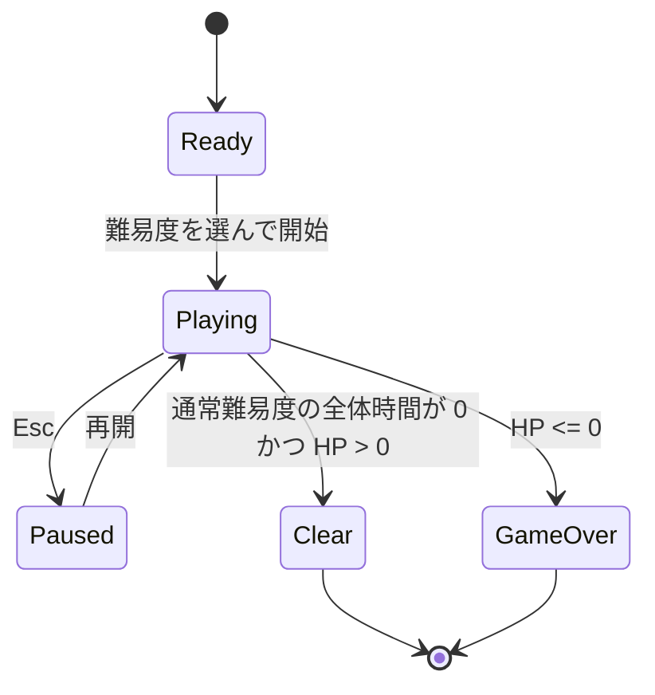

# コアゲームプレイ仕様

> **ステータス: 実装前の合意済み仕様（2026-08-03）**
> 画面構成と接続の詳細は [メインゲーム画面・接続仕様](main-game-flow.md)、個別ゲームの仕様は各ページを正とする。

企画: [ゲーム企画概要](../GameDesign/game-overview.md)
現行実装: [アーキテクチャ概要](../Architecture/overview.md)

## 1. 適用範囲

本仕様は、1 プレイの状態、PC / パッドへのタスク生成、AI 代行、HP、スコア、終了判定を定義する。すべてのゲームプレイは Canvas UI 内で完結し、2D / 3D 物理には依存しない。

## 2. 用語

| 用語 | 定義 |
| --- | --- |
| ゲーム難易度 | Easy、Normal、Hard、Very Hard、Endless のプレイ全体の難しさ。 |
| 問題レベル | 1–4 の各ミニゲーム内で使う出題・形状の難しさ。 |
| タスク面 | PC またはパッド。タスク吹き出しを保持する UI 領域。 |
| タスク | 種別、問題レベル、寿命、タスク面を持つ 1 件の処理対象。 |
| タスク寿命 | 未着手の吹き出しが消えるまでの残り時間。 |
| ミニゲーム制限時間 | 自力開始後、ミニゲームを完了するまでの時間。 |
| 解決結果 | 自力成功、自力失敗、AI 成功、AI 失敗、未着手時間切れのいずれか。 |

## 3. 状態遷移

`Playing` 中のタスクは、未着手、プレイヤー実行中、AI 処理中、解決済みのいずれかである。プレイヤー実行中にできるタスクは常に 1 件までとする。AI 処理中の件数は制限しない。

ポーズ中は `Time.timeScale = 0` とし、全体時間、タスク寿命、ミニゲーム制限時間、AI 処理時間をすべて停止する。

## 4. タスク生成と寿命

1. `Playing` 開始後、設定された間隔でタスクを 1 件生成する。
2. 生成先は PC またはパッドである。表示中でないタスク面にも生成してよい。
3. タスクは種別、問題レベル、寿命、ミニゲーム制限時間、アイコンを持つ。
4. 未着手タスクの寿命は、プレイヤーが別のミニゲームを実行中でも減少する。
5. 左クリックで自力開始したタスクは、寿命を止めてミニゲーム制限時間へ移行する。
6. 右クリックで AI を依頼したタスクは、寿命を停止し、AI 処理時間終了時に 1 回だけ解決する。
7. 未着手の寿命が 0 になったタスクは `未着手時間切れ` として解決する。

解決済み・AI 処理中・プレイヤー実行中のタスクは、再選択・再解決できない。ゲーム終了時は未解決タスクと実行中ミニゲームを中断し、追加の結果通知を受け付けない。

## 5. AI 代行

| 項目 | 初期値 | 所有者 |
| --- | ---: | --- |
| 処理時間 | 0.4 秒 | `GameTuningSettings.ai` |
| 成功率 | 90% | `GameTuningSettings.ai` |
| 成功時スコア倍率 | 0.60 | `GameTuningSettings.ai` |
| クールタイム | 0.0 秒 | `GameTuningSettings.ai.cooldownSec` |

- AI 依頼はタスク吹き出しの右クリックで行う。自力ミニゲームを開く必要はない。
- `cooldownSec` が正の場合だけ、前回の依頼から同秒数が経過するまで新規依頼を受け付けず、UI で使用不能を表す。P0 の初期値は `0.0` のため、AI は複数タスクを直ちに並行処理できる。
- 依頼済みタスクは AI 処理中表示にし、別の AI 依頼または自力プレイを妨げない。
- AI 判定は処理終了時に 1 回だけ行い、成功率に従って解決する。

## 6. HP、スコア、終了判定

| 結果 | HP | スコア |
| --- | ---: | --- |
| 自力成功 | 変化なし | `基礎点 × (1 + 0.5 × 残り寿命比)` |
| AI 成功 | 変化なし | 自力成功スコア × AI 倍率 |
| 自力失敗 | -5 | 0 |
| AI 失敗 | -5 | 0 |
| 未着手時間切れ | -8 | 0 |

残り寿命比は、自力開始または AI 依頼の直前に `残り寿命 / 初期寿命` として確定する。基礎点は問題レベルごとに設定する。レベル 1–3 は既存の `GameTuningSettings.score` の値を初期値に利用し、レベル 4 の値は追加時に設定する。

HP が 0 以下になったフレームでは、全体時間の残りにかかわらずゲームオーバーを優先する。通常難易度は全体時間が 0 になった時点で HP が正ならクリアとする。Endless はクリアにならない。

## 7. 初期パラメータ

| 項目 | Easy | Normal | Hard | Very Hard | Endless |
| --- | ---: | ---: | ---: | ---: | ---: |
| 全体時間 | 180 秒 | 180 秒 | 180 秒 | 180 秒 | なし |
| 問題レベル | 1 | 1–2 | 2–3 | 3–4 | 1–4 |
| 初期 HP | 100 | 100 | 100 | 100 | 100 |

> TODO（2026-08-03）: 生成間隔、タスク寿命、同時表示上限、レベル上昇時刻、レベル 4 の基礎点はプレイテストで確定する。

## 8. 入力・UI 共通要件

- 左クリックは自力開始、右クリックは AI 依頼である。UI のクリック処理は Input System と EventSystem を用いる。
- HUD は全体時間（Endless では経過時間）、HP、スコアを常時表示する。`cooldownSec` が正の場合は AI クールタイムも表示する。
- タスク吹き出しは種別アイコン、問題レベル、残り寿命ゲージ、AI 処理中表示を持つ。
- Esc はポーズを開く。ポーズには再開、難易度選択へ戻る、オプションを置く。
- 画面切替は UI ボタンでのみ行う。キーボードショートカットの追加は将来検討とする。

## 9. 例外と確認項目

| 事象 | 必要な扱い |
| --- | --- |
| AI 処理中にゲーム終了 | 判定せず、結果を追加しない。 |
| 自力ミニゲーム中にゲーム終了 | ミニゲームを中断し、完了イベントを無視する。 |
| プレイヤー実行中に別タスクを左クリック | 選択を受け付けない。 |
| `cooldownSec` が正で、クールタイム中の右クリック | 新規依頼を受け付けない。 |
| タスク面が非表示 | タスクの時間・AI 処理は止めない。 |

最小確認は、PC / パッド両方への生成、非表示面の寿命継続、自力・AI の各解決、HP 0、通常難易度クリア、Endless 継続、ポーズ停止を含める。
