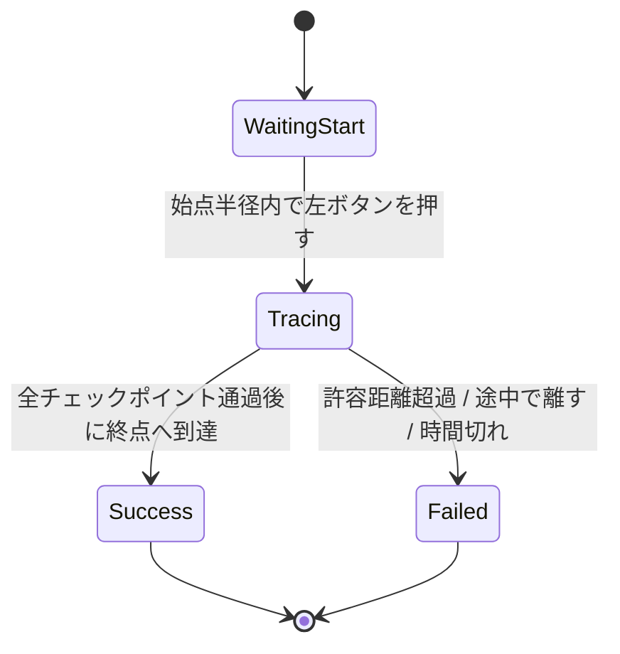

# なぞりミニゲーム仕様

> **ステータス: 実装前の合意済み仕様（2026-08-03）**

企画: [ゲーム企画概要](../GameDesign/game-overview.md)
共通ルール: [コアゲームプレイ仕様](gameplay-core.md) / 接続: [メインゲーム画面・接続仕様](main-game-flow.md)

## 1. 適用範囲

本仕様は、Canvas UI 上のガイド線をマウスポインターでなぞるミニゲームを定義する。`TracingMiniGame` は `MiniGameBase` を継承し、成否を共通の完了イベントで返す。2D / 3D Collider および Physics は使わない。

## 2. 問題データ

`TracingPathDatabase` ScriptableObject は、レベル別の `TracingPathEntry` を持つ。

| 項目 | 型 | 説明 |
| --- | --- | --- |
| PathId | string | デバッグと重複回避に用いる識別子。 |
| レベル | 1–4 | 出題対象の問題レベル。 |
| Points | Vector2 配列 | `TracingArea` の左下を `(0, 0)`、右上を `(1, 1)` とした正規化座標で表した、始点から終点までのチェックポイント列。 |
| CheckpointRadiusRatio | float | `TracingArea` の短辺に対する、次の点を通過したとみなす距離の比率。 |
| AllowedDeviationRatio | float | `TracingArea` の短辺に対する、逸脱して失敗する距離の比率。 |
| TimeLimit | float | この問題の制限時間。カタログ設定を上書きする場合のみ使用する。 |

各レベルには最低 1 件の有効な経路を置く。レベルに有効な問題がない場合は設定不備として開始せず、失敗理由 `NO PATH CONFIGURED` を 1 回だけ返す。

## 3. 入力と状態

- 始点半径内で左ボタンを押した時だけなぞりを開始する。
- ドラッグ中は現在座標からガイド線への最短距離を測る。`AllowedDeviation` を超えた時点で失敗する。
- チェックポイントは順番に通過する。終点を含む全点を通過した時点で成功する。
- 左ボタンを途中で離した場合は `TRACE RELEASED` として失敗する。
- Canvas の座標変換は `RectTransformUtility.ScreenPointToLocalPointInRectangle` を用いる。得たローカル座標を `TracingArea` 内の正規化座標へ変換して問題データと比較する。

## 4. 難易度

| レベル | 形状 | 許容距離 | 制限時間 |
| --- | --- | --- | --- |
| 1 | 短い直線・緩い曲線 | 広い | 長い |
| 2 | 曲線または折れ線 | 標準 | 標準 |
| 3 | 長い経路・急な曲がり | 狭い | 短い |
| 4 | 複雑な経路・密な点列 | 最も狭い | 最も短い |

具体値は問題データと `GameTuningSettings.miniGameTimes.tracing` に集約し、プレイテストで決定する。

## 5. UI

- ガイド線、始点、終点、現在の進捗、残り時間を表示する。
- 通過済み区間は色を変え、次の目標点が分かるようにする。
- 失敗時は逸脱または離したことを明確に表示し、成功時は完走を明確に表示する。
- UI は `MiniGameHost` 配下の Prefab とし、ミニゲーム終了後に破棄する。
- `TracingArea` の画面上の位置・大きさは後から調整してよい。経路データと判定しきい値は正規化座標・比率のため再作成しない。

## 6. 確認項目

1. 始点外でのクリックでは開始しない。
2. 正しい順番ですべての点を通過すると成功が 1 回だけ通知される。
3. 許容距離を超える、または途中で離すと失敗が 1 回だけ通知される。
4. 制限時間切れが共通基底から 1 回だけ通知される。
5. Canvas Scaler の異なる画面サイズでも判定位置が描画位置と一致する。
